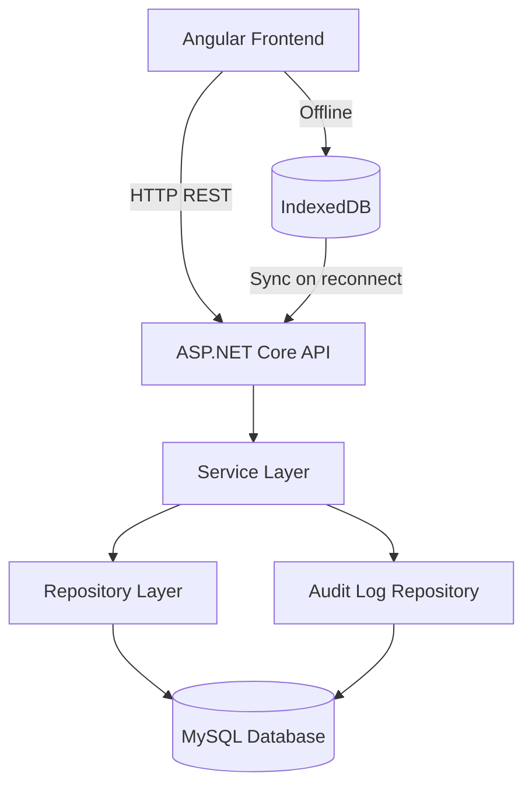
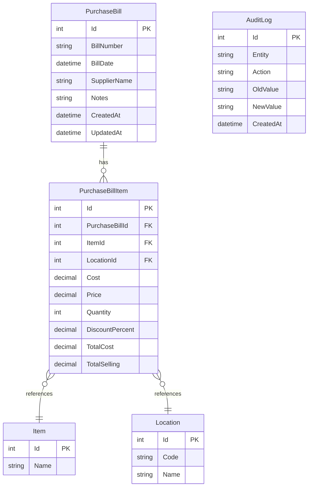
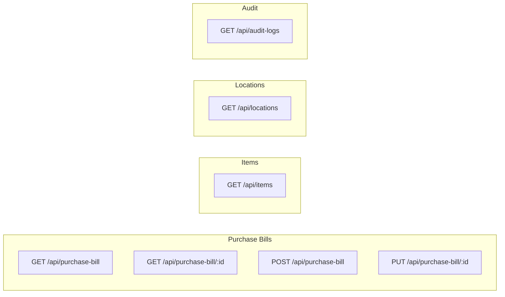
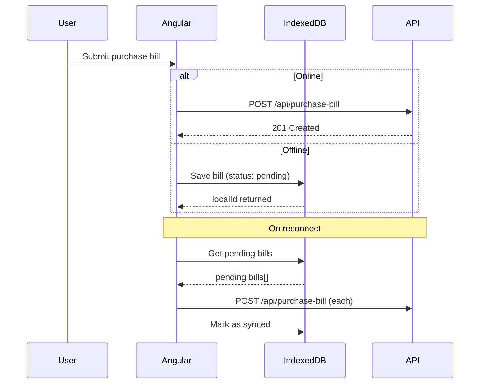

# Purchase Management System

A full-stack purchase bill management application built with ASP.NET Core 10 (backend) and Angular 21 (frontend). It supports creating and editing purchase bills, tracking audit logs, and saving bills offline when the network is unavailable.

---

## Tech Stack

- Backend: ASP.NET Core 10, Entity Framework Core, MySQL
- Frontend: Angular 21, IndexedDB (via `idb`) for offline support
- Database: MySQL

---

## Project Structure

```
/
├── backend/                  # ASP.NET Core Web API
│   ├── Controllers/          # API route handlers
│   ├── Services/             # Business logic layer
│   ├── Repositories/         # Data access layer
│   ├── Entities/             # EF Core entity models
│   ├── DTOs/                 # Data transfer objects
│   ├── Data/                 # DbContext
│   └── Migrations/           # EF Core migrations
└── frontend/                 # Angular SPA
    └── src/app/
        ├── core/             # Services, models, interceptors
        ├── modules/purchase/ # Purchase bills & audit log pages
        └── shared/           # Pipes, shared components
```

---

## Architecture



---

## Data Model



---

## API Endpoints



---

## Frontend Routes

| Path | Component | Description |
|------|-----------|-------------|
| `/purchase` | PurchaseListComponent | List all purchase bills |
| `/purchase/new` | PurchaseFormComponent | Create a new bill |
| `/purchase/edit/:id` | PurchaseFormComponent | Edit an existing bill |
| `/audit` | AuditLogComponent | View audit history |

---

## Getting Started

### Prerequisites

- .NET 10 SDK
- Node.js 20+ and npm
- MySQL server

### Backend Setup

1. Copy the environment file and fill in your database credentials:

```bash
cp backend/.env.example backend/.env
```

```env
DB_HOST=localhost
DB_PORT=3306
DB_NAME=PurchaseManagementDB
DB_USER=your_db_user
DB_PASSWORD=your_db_password
```

2. Run the API (migrations are applied automatically on startup):

```bash
cd backend
dotnet run
```

The API will be available at `http://localhost:5000`.

### Frontend Setup

```bash
cd frontend
npm install
ng serve
```

The app will be available at `http://localhost:4200`.

---

## Offline Support

When the network is unavailable, purchase bills are saved locally in IndexedDB under the `purchase-mgmt` database. Pending bills are synced back to the server when connectivity is restored.



---

## Audit Logging

Every create and update operation on a purchase bill is recorded in the `AuditLog` table, storing the old and new JSON values for full change history.
